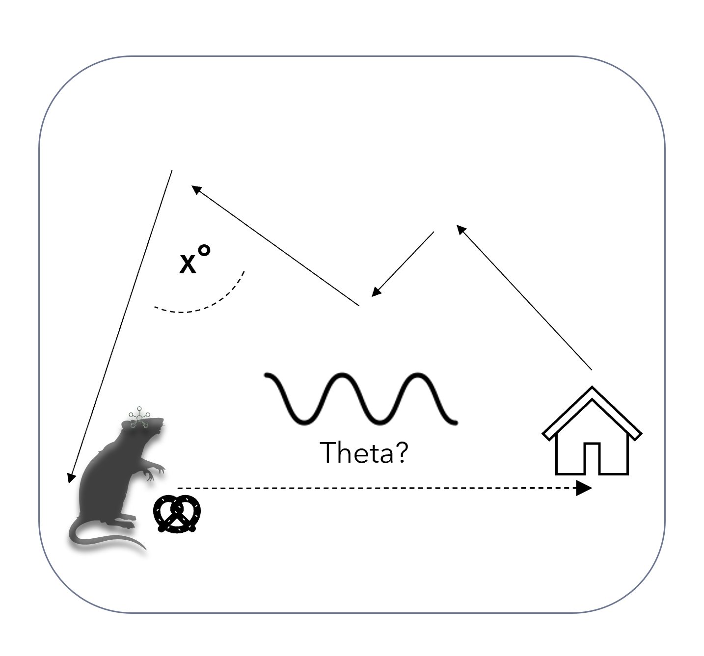

<div id="top"></div>
<!--

-->


<!-- PROJECT SHIELDS -->
<!--

-->
[![Contributors][contributors-shield]][contributors-url]
[![Forks][forks-shield]][forks-url]
[![Stargazers][stars-shield]][stars-url]
[![Issues][issues-shield]][issues-url]
[![MIT License][license-shield]][license-url]
[![LinkedIn][linkedin-shield]][linkedin-url]


<!-- PROJECT LOGO -->
<br />
<div align="center">
  <a href="https://github.com/Fabalinks/Rearing_analysis">
    
  </a>

<h3 align="center">Rearing analysis</h3>

  <p align="center">
    Dedicated to analyzing rearign behavior in rats in Ratcave VR
    <br />
  </p>
</div>


<!-- TABLE OF CONTENTS -->
<details>
  <summary>Table of Contents</summary>
  <ol>
    <li>
      <a href="#about-the-project">About The Project</a>
      <ul>
    </li>
    <li>
      <a href="#getting-started">Getting Started</a>
      <ul>
        <li><a href="#installation">Installation</a></li>
      </ul>
    </li>
    <li><a href="#data-description">Data Description</a></li>
    <li><a href="#contributing">Contributing</a></li>
    <li><a href="#license">License</a></li>
    <li><a href="#contact">Contact</a></li>
    <li><a href="#acknowledgments">Acknowledgments</a></li>
  </ol>
</details>


<!-- ABOUT THE PROJECT -->
## About The Project

<br />
<div align="center">
  <a href="https://github.com/Fabalinks/Rearing_analysis">
    
  </a>
</div>


Research to uncover the neural basis behind Path integration.
In this project we use virtual reality with freely moving rodents while recording
electrophysiological signal from the Hippocampus CA1.
Animals are taught to rear at a visible beacon in the virtual arena,
retrieve a randomly distributed reward and go back to the original location
where the beacon was, but this time in darkness. We focus on understanding
how the animal accumulates vectors as it travels to the reward and then
when it needs to retrieve/calculate a correct vector to the original location.
In this analysis we focus on proving the rearing behavior at the beacon.


<p align="right">(<a href="#top">back to top</a>)</p>


<!-- GETTING STARTED -->
### Installation

 * pip
  ```sh
  pip install https://github.com/Fabalinks/Rearing_analysis
  ```

<p align="right">(<a href="#top">back to top</a>)</p>


<!-- Data Description -->
## Data description

During an experimental session 3 files are generated.

position datetime.txt (rotation in quaternion coordinates):

| Time     | X rat | Y rat | Z rat | X rotation_rat | Y rotation_rat| Z rotation_rat | Motive Frame|Motive timestamp|Motive session timestamp|
| ----------- | ----------- | ----------- | ----------- | ----------- | ----------- | ----------- | ----------- | ----------- | ----------- |


beacons datetime.txt:

 | Time     | X rat | Y rat | Z rat | X beacon | Y beacon|
 | ----------- | ----------- | ----------- | ----------- | ----------- | ----------- |

metadata datetime.txt

self explanatory text file that can be machine read out


<p align="right">(<a href="#top">back to top</a>)</p>

<!-- Data Description -->
## Jupyter notebooks descriptions

[20210505_Calibration_arena_movement](https://github.com/Fabalinks/Rearing_analysis/blob/main/Code/20210505_Calibration_arena_movement.ipynb)
  Calculating vestibular/ physical  displacement of the arena.

[20210507_Positions_together](https://github.com/Fabalinks/Rearing_analysis/blob/main/Code/20210507_Positions_together.ipynb)
Moving of event files together

[20210512_File_moving](https://github.com/Fabalinks/Rearing_analysis/blob/main/Code/20210512_File_moving%20.ipynb)
      Moving of ephys files together.

[20210517_FS_Joining_txt_frame_number](https://github.com/Fabalinks/Rearing_analysis/blob/main/Code/20210517_FS_Joining_txt_frame_number.ipynb)
        Create spreadsheet with events and frame numbers for ephys sync

[20210525_FS_Borderless_rears](https://github.com/Fabalinks/Rearing_analysis/blob/main/Code/20210525_FS_Borderless_rears%20.ipynb)
          Looking at trajectories, rear and events only inside the boundary of arena - redundant later    

[20210525_FS_Identify_invisible_beacon](https://github.com/Fabalinks/Rearing_analysis/blob/main/Code/20210525_FS_Identify_invisible_beacon.ipynb)
            getting only invisible beacon time out  

[20210525_FS_LT_Performance_FS03-FS06](https://github.com/Fabalinks/Rearing_analysis/blob/main/Code/20210525_FS_LT_Performance_FS03-FS06.ipynb)
Plotting Long Term performance of each rat with beacon metrics

[20210525_FS_Z_Time_FS03_FS06](https://github.com/Fabalinks/Rearing_analysis/blob/main/Code/20210525_FS_Z_Time_FS03_FS06.ipynb)
Identify time spent rearing and graph

[20210526_FS_rearing_histogram](https://github.com/Fabalinks/Rearing_analysis/blob/main/Code/20210526_FS_rearing_histogram.ipynb)
Creates a data frame including all events with all information about trial to be exported and analysed later

[20210628_FS_Calibration_File_visualization](https://github.com/Fabalinks/Rearing_analysis/blob/main/Code/20210628_FS_Calibration_File_visualization.ipynb)
Uses predetected file for calibration settings which are then hardcoded  

[20210706_FS_rearing_fatigue](https://github.com/Fabalinks/Rearing_analysis/blob/main/Code/20210706_FS_rearing_fatigue.ipynb)
Calculating fatigue in a trial - not finished

[20210811_FS_Normalize_occupancy_bins](https://github.com/Fabalinks/Rearing_analysis/blob/main/Code/20210811_FS_Normalize_occupancy_bins.ipynb)
Use area estimation to be able to normalize rearing attempts within a given beacon position - uses file from 20210526_FS_rearing_histogram


[20210811_FS_Plotting_Normalize_occupancy_bins](https://github.com/Fabalinks/Rearing_analysis/blob/main/Code/20210811_FS_Plotting_Normalize_occupancy_bins.ipynb)
Plots histogram of rears around beacon which is normalized.

[20211108_FS_visualize_radius](https://github.com/Fabalinks/Rearing_analysis/blob/main/Code/20211108_FS_visualize_radius.ipynb)
Plots area differences between circle sizes.

[20211111_FS_Normalization_problem](https://github.com/Fabalinks/Rearing_analysis/blob/main/Code/20211111_FS_Normalization_problem.ipynb)
Simplified to solve normalization problem.

[20211125_FS_rearing_dynamics_simple](https://github.com/Fabalinks/Rearing_analysis/blob/main/Code/20211125_FS_rearing_dynamics_simple.ipynb)
Makes a Dataframe with rear events and trajectories surrounding it.


[20211201_FS_rearing_dynamics_PLOTTING](https://github.com/Fabalinks/Rearing_analysis/blob/main/Code/20211201_FS_rearing_dynamics_PLOTTING.ipynb)
Plotting of the rearing dynamics around beacon for progress report

[20211708_FS_Pseudorandom_disttribution](https://github.com/Fabalinks/Rearing_analysis/blob/main/Code/20211708_FS_Pseudorandom_disttribution.ipynb)
making the next beacon to be pseudorandomly assigned at least x cm away from last one.


<p align="right">(<a href="#top">back to top</a>)</p>

<!-- CONTRIBUTING -->
## Contributing

1. Fork the Project
2. Create your Feature Branch (`git checkout -b analysis/New_stuff`)
3. Commit your Changes (`git commit -m 'Add some New_stuff'`)
4. Push to the Branch (`git push origin analysis/New_stuff`)
5. Open a Pull Request

<p align="right">(<a href="#top">back to top</a>)</p>


<!-- LICENSE -->
## License

Distributed under the Apache License. See `LICENSE.txt` for more information.

<p align="right">(<a href="#top">back to top</a>)</p>


<!-- CONTACT -->
## Contact

Fabian Stocek - [@fabalinks](https://twitter.com/@fabalinks) - stocek@bio.lmu.de

Project Link: [https://github.com/Fabalinks/Rearing_analysis](https://github.com/Fabalinks/Rearing_analysis)

<p align="right">(<a href="#top">back to top</a>)</p>


<!-- ACKNOWLEDGMENTS -->
## Acknowledgments

* [Sirota lab](https://cogneuro.bio.lmu.de/people/group-members/sirota/index.html)
* [ Funding - RTG 2175](https://www.rtg2175.bio.lmu.de/index.html)
* [Jin Lee](https://github.com/jinhl9)

<p align="right">(<a href="#top">back to top</a>)</p>


<!-- MARKDOWN LINKS & IMAGES -->
<!-- https://www.markdownguide.org/basic-syntax/#reference-style-links -->

[20210505_Calibration_arena_movement]:[https://github.com/Fabalinks/Rearing_analysis/blob/main/Code/20210505_Calibration_arena_movement.ipynb


[contributors-shield]: https://img.shields.io/github/contributors/Fabalinks/Rearing_analysis.svg?style=for-the-badge
[contributors-url]: https://github.com/Fabalinks/Rearing_analysis/graphs/contributors
[forks-shield]: https://img.shields.io/github/forks/Fabalinks/Rearing_analysis.svg?style=for-the-badge
[forks-url]: https://github.com/Fabalinks/Rearing_analysis/network/members
[stars-shield]: https://img.shields.io/github/stars/Fabalinks/Rearing_analysis.svg?style=for-the-badge
[stars-url]: https://github.com/Fabalinks/Rearing_analysis/stargazers
[issues-shield]: https://img.shields.io/github/issues/Fabalinks/Rearing_analysis.svg?style=for-the-badge
[issues-url]: https://github.com/Fabalinks/Rearing_analysis/issues
[license-shield]: https://img.shields.io/github/license/Fabalinks/Rearing_analysis.svg?style=for-the-badge
[license-url]: https://github.com/Fabalinks/Rearing_analysis/blob/master/LICENSE.txt
[linkedin-shield]: https://img.shields.io/badge/-LinkedIn-black.svg?style=for-the-badge&logo=linkedin&colorB=555
[linkedin-url]: https://www.linkedin.com/in/fabian-stocek/
[product-screenshot]: images/screenshot.png
